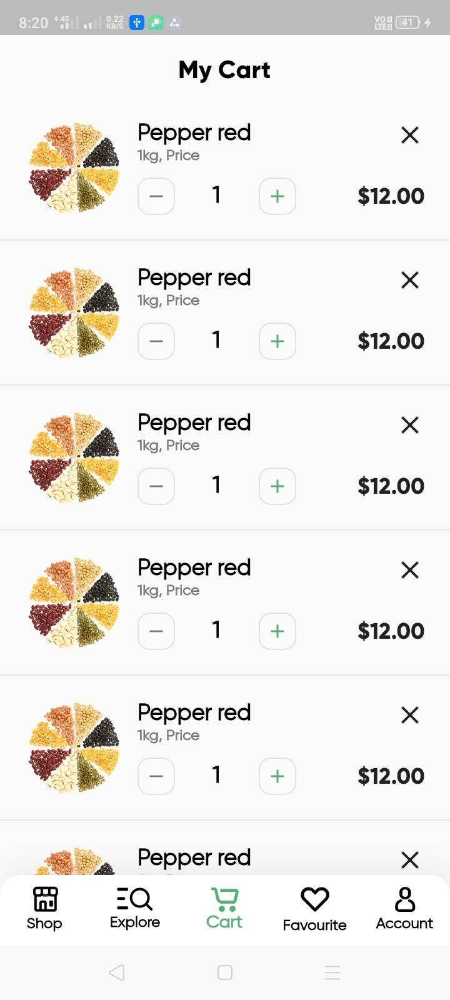

Flutter Grocery App UI  
-------------  
### Try the apk from the [Release Tab](https://github.com/Sharath-B-Naik/Flutter-Grocery-UI/releases/download/v1.0.0/app-release.apk)  
-------------
  
#### Flutter Version : 2.10.4  
#### Design By: [Afsar Hossen](https://www.linkedin.com/in/afsar-shuvo/)  
#### Desing Files on Figma : [Online Groceries App UI](https://www.figma.com/community/file/882645007956337261)  
  
-------------  

## Screenshots  

  
   
  
  
   

-------------  

## Screens  
- Splash Screen  
- Welcome Screen  
- Home Screen(Shop)  
- Product Details Screen  
- Categories Screen (Explore)  
- Individual Product Screen.
- Filter Screen  
- Cart Screen  
- Checkout Bottom Sheet  
- Order Failed Dialog  
- Order Accepted Screen  
- Profile Screen